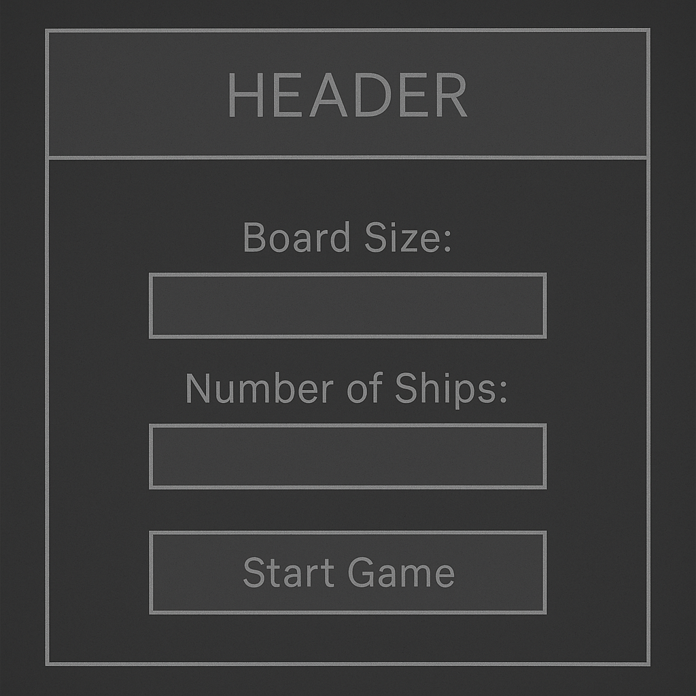
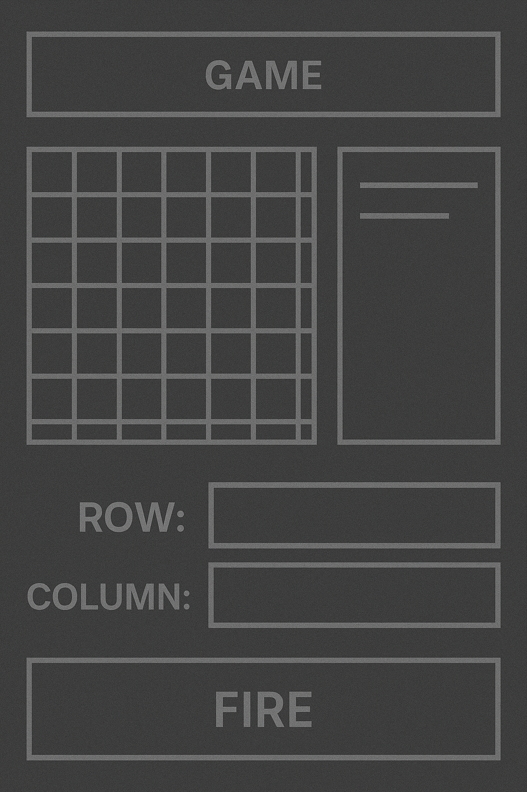

# Fleet Commander

**[Fleet Comander Battleship Game](https://fleet-commander-fa53b64ab5ce.herokuapp.com/)**  

Fleet Commander is a **WW2-themed Battleship strategy game** where players face off against the AI in a turn-based sea battle. The game features a **modern web interface** with a nostalgic WW2 aesthetic, allowing players to pick their nation, place attacks on the enemy fleet, and see real-time hit/miss results.  

Built with **Python (Flask)** and deployed to **Heroku**, it offers an interactive, easy-to-use experience accessible directly from the browser.  

---

##  Features

✅ Player vs AI Battleship gameplay  
✅ Configurable grid size  
✅ WW2-inspired theme (Allies vs Axis)  
✅ Visual feedback for hits & misses  
✅ Previous shots remain visible on the board  
✅ Real-time turn tracking  
✅ Randomized enemy ship placement  
✅ Fully responsive for desktop & laptop play  
✅ Hosted live on Heroku  

---

##  Technologies

- Python 3.10  
- Flask  
- HTML5, CSS3, Jinja2  
- Bootstrap (styling)  
- Gunicorn (Heroku deployment)  
- Heroku  
- Git / GitHub  

---

##  Design & Wireframes

Fleet Commander was designed to combine **classic Battleship gameplay** with a **cinematic World War II naval theme**.  
The interface draws inspiration from historical maps, radar displays, and military command consoles.

### Theme
- **Background**: Faded naval charts with plotted coordinates
- **Colors**: Navy blue, steel grey, and red for enemy hits
- **Typography**: Bold military-style headers with clean sans-serif body text
- **Icons**: Allied and Axis insignias (Iron Cross, Rising Sun, Italian tricolore) for faction identification

### Wireframes

#### 1️⃣ Game Setup Screen
Players choose:
- Board size (small, medium, large)
- Number of ships
- Faction (Allies or Axis)

#### 2️⃣ Gameplay Screen
- Player's grid on the left, enemy grid on the right
- Hits marked with **red X**
- Misses marked with **white circles**
- Turn counter and battle log below

---

## How to Play

When the game starts, you will be greeted and asked to choose a board size. Enter a number between 4 and 10.

Next, specify how many ships the computer should hide. You can pick any number from 1 up to about a quarter of the available cells on the board. For example, on a 6×6 grid the maximum number of ships is 9.

The game will calculate the number of turns you have to sink all the ships and display a blank grid.

Make your guesses by entering the row and column numbers (both starting at 1). The game will inform you whether your guess is a hit or a miss, update the board, and decrement your remaining turns. If you repeat a guess, you’ll be prompted to choose another location without losing a turn.

Continue guessing until you either sink every ship or run out of turns. At the end of the game, the board (and any remaining ships) will be revealed, and you’ll receive a victory or defeat message.

## Game Logic

The game is divided into modular functions for clarity:

create_board(size) – constructs a 2D list to represent an empty board.

place_ships(board_size, number_of_ships) – randomly selects ship positions without overlap and returns a set of coordinate tuples.

display_board(board, show_ships=False, ships=None) – prints the grid to the terminal. When show_ships is True, it reveals unhit ships.

get_integer_input(prompt, min_value, max_value) – helper function that keeps asking the user for a number within a specified range until a valid input is provided.

get_guess(size) – prompts the user for a row and column guess, validating both.

update_board(board, guess, ships) – marks hits (X) and misses (O) on the board, removes sunk ships from the set and reports whether a guess was a hit, miss or repeat.

game_loop() – orchestrates the entire game: setup, taking turns, updating the board and checking for win/lose conditions.

##  Game Play

- Select Board Size & Country
- Fire at coordinates (row/column) until all enemy ships are destroyed or turns run out
- Hits show as red, misses as blue

  Play ends when:
  
- All ships are sunk (Victory)
- No turns remain (Defeat)

## Testing
Linting – run flake8 or pycodestyle to check for PEP 8 compliance:

flake8 battleship_game.py
flake8 app.py
flake8 units.py

- Manual testing – play the game several times with different board sizes and ship counts to ensure:

Input validation works (non‑numeric input is rejected; out‑of‑range values are caught).

The game does not crash when repeating guesses.

Turns decrement correctly, and the game ends properly when turns expire or ships are sunk.

Ships are placed randomly and never overlap.

- Edge cases – test the smallest (4×4) and largest (10×10) board sizes to ensure the game scales as expected.

## Future Improvements

Add multiple ship sizes and orient ships horizontally or vertically, similar to the traditional board game.
Implement a replay option without restarting the program.
Provide a scoring system or leaderboard stored in a file or database.
Create a graphical user interface (GUI) using a library like tkinter or pygame.

## Live Demo

👉 [Fleet Comamander Battleship Game](https://fleet-commander-fa53b64ab5ce.herokuapp.com/)  

---

##  Issues & Solutions

1️⃣ **Jinja2 enumerate undefined**  
**Fix:**  
Used `loop.index0` inside Jinja templates instead of Python’s `enumerate()`.

---

2️⃣ **Jinja2 `do` tag error**  
**Fix:**  
Removed `` statements and instead built `classes` lists in Python before passing to templates.

---

3️⃣ **Player hit markers disappearing**  
**Fix:**  
Stored fired positions in session data so that grid cells remain marked until the game ends.

---

##  Known Limitations

- No multiplayer mode (AI only)
- Desktop-focused design (mobile responsive but not optimized for small screens)
- Fixed ship types per game

---

## Sources & References

- Flask Documentation – For building the web application framework.
https://flask.palletsprojects.com/

- Python 3 Documentation – For standard library usage and syntax reference.
https://docs.python.org/3/

- PEP 8 – Style Guide for Python Code – For ensuring code meets style standards.
https://peps.python.org/pep-0008/

- Jinja2 Documentation – For HTML templating in Flask.
https://jinja.palletsprojects.com/

- Bootstrap 5 Documentation – For styling the UI and responsive grid layout.
https://getbootstrap.com/

- Heroku Dev Center – For deployment setup and configuration.
https://devcenter.heroku.com/

- GitHub Docs – For version control and README formatting.
https://docs.github.com/

- Glory of Generals (EasyTech) – Inspiration for the WW2 theme, faction selection, and battle styles.
https://www.ieasytech.com/en/

- Noun Project & Flaticon – For naval and WW2 iconography.
https://thenounproject.com/
https://www.flaticon.com/

- Stack Overflow – For troubleshooting Flask routing, static files, and CSS loading issues.
https://stackoverflow.com/

---

## Credits

Created by Dillon Malone

WW2 theme inspired by Glory of Generals series
Battleship concept adapted from classic board game mechanics

